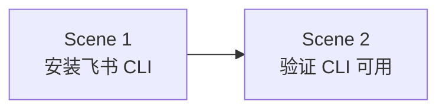

# 沟通管理 — 课时1：飞书协作

课时 "沟通管理" 的第一个课时，包含 2 个场景（Scene），顺序推进：

## 场景列表

| 场景 | 标题 | 描述 | 前置依赖 |
|------|------|---------|---------|
| Scene 1 | 安装飞书 CLI | 通过 AI Agent 安装飞书 CLI | 无 |
| Scene 2 | 验证 CLI 可用 | 根据提示处理测试，如通过 lark-cli 访问最近一周的聊天记录 | Scene 1 |

## 场景关系

每个场景录制一段短视频，学员按序观看并操作。场景走完后按验收标准自检，全部通过即完成本课时。

## 验收标准

课时完成的标准（全部满足）：

1. 飞书 CLI 安装成功，可正常执行 lark-cli 命令
2. 通过 lark-cli 完成测试任务，访问最近一周的聊天记录

未通过时回到对应场景排查（检查网络与代理设置），重试直至通过。
