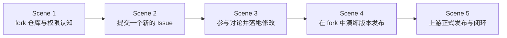

# DevOps 工程 — 课时1：GitHub 开源协作

课时 "DevOps 工程" 的第一个课时，包含 5 个场景（Scene），顺序推进：

## 场景列表

| 场景 | 标题 | 描述 | 前置依赖 |
|------|------|---------|---------|
| Scene 1 | fork 仓库与权限认知 | fork `quanttide/bylaw-of-document-engineering`，通读章程与文档，用"三问清单"找出可改进点；理解 GitHub 权限分级与发布权限 | 无 |
| Scene 2 | 提交一个新的 Issue | 把改进点整理成结构化建议，在仓库 Issues 新建一个 Issue | Scene 1 |
| Scene 3 | 参与讨论并落地修改 | 跟进讨论、回复评论，达成共识后提交 PR 合并到上游 | Scene 2 |
| Scene 4 | 在 fork 中演练版本发布 | 在自己的 fork 上完整演练发布：版本号、CHANGELOG、提交、tag、Release | Scene 3 |
| Scene 5 | 上游正式发布与闭环 | 维护者合并 PR 后执行正式发布，学员见证自己的改动变成真实 Release | Scene 4 |

## 场景关系

每个场景录制一段短视频，学员按序观看并操作。本课时为**开放式任务**：不限定具体文档或具体问题，任何"顺手 / 困惑 / 缺失"的反馈都可以成为 Issue，长期有效。版本发布在学员自己的 fork 中演练（fork 拥有完整权限），上游正式发布由维护者执行——这本身就是真实协作的常态。

## 验收标准

课时完成的标准（全部满足）：

1. 提交的 Issue 获得维护者或他人的有效回复
2. PR 被合并，或维护者明确说明暂不合并的原因

未通过时按审阅意见修改后重新提交；被拒绝时记录原因并转为 Issue 建议。
