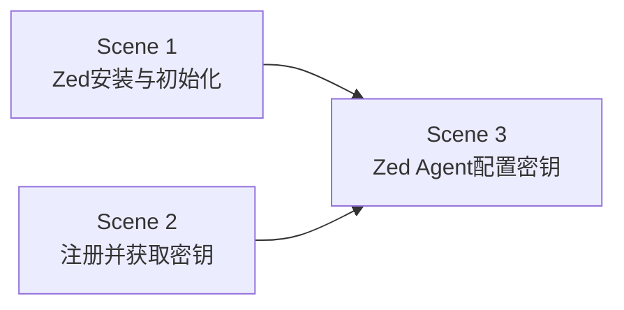

# 氛围编程 — 课时1：开发环境搭建

课时 "氛围编程" 的第一个课时，包含 3 个场景（Scene），顺序推进：

## 场景列表

| 场景 | 标题 | 描述 | 前置依赖 |
|------|------|---------|---------|
| Scene 1 | Zed 的安装与初始化 | 下载安装 Zed，完成主题、快捷键、插件等基础设置 | 无 |
| Scene 2 | 注册并获取 DeepSeek 密钥 | 注册 DeepSeek 账号，生成并复制 API 密钥 | 无 |
| Scene 3 | Zed Agent 配置 DeepSeek 密钥 | 在 Zed 的 Assistant 面板中填入密钥，验证连接可用 | Scene 1 + Scene 2 |

## 场景关系

每个场景录制一段短视频，学员按序观看并操作。Scene 3 完成后即完成本课时。
