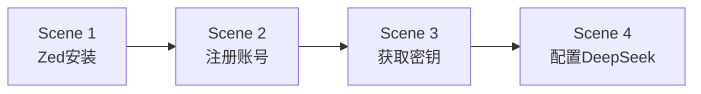

# 氛围编程 — 课时1：开发环境搭建

课时 "氛围编程" 的第一个课时，包含 4 个场景（Scene），顺序推进：

## 场景列表

| 场景 | 标题 | 内容概要 |
|------|------|---------|
| Scene 1 | Zed 的安装 | 下载、安装 Zed 编辑器，完成初始配置 |
| Scene 2 | 注册 DeepSeek 账号 | 访问 DeepSeek 官网，完成注册与登录 |
| Scene 3 | 获取 DeepSeek 密钥 | 进入 API 管理页面，生成并复制密钥 |
| Scene 4 | 配置 DeepSeek | 在 Zed 中配置密钥，验证连接可用 |

## 场景关系

每个场景录制一段短视频，学员按序观看并操作。Scene 4 完成后即完成本课时。
