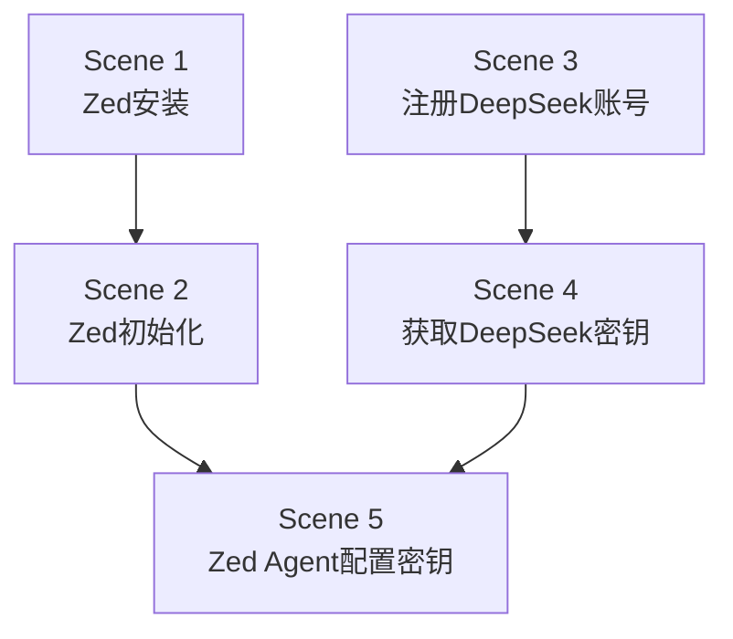

# 氛围编程 — 课时1：开发环境搭建

课时 "氛围编程" 的第一个课时，包含 5 个场景（Scene），顺序推进：

## 场景列表

| 场景 | 标题 | 描述 | 前置依赖 |
|------|------|---------|---------|
| Scene 1 | Zed 的安装 | 下载、安装 Zed 编辑器，完成初始配置 | 无 |
| Scene 2 | Zed 的初始化配置 | 打开 Zed，完成主题、快捷键、插件等基础设置 | Scene 1 |
| Scene 3 | 注册 DeepSeek 账号 | 访问 DeepSeek 官网，完成注册与登录 | 无 |
| Scene 4 | 获取 DeepSeek 密钥 | 登录 DeepSeek 后进入 API 管理页面，生成并复制密钥 | Scene 3 |
| Scene 5 | Zed Agent 配置 DeepSeek 密钥 | 在 Zed 的 Assistant 面板中填入密钥，验证连接可用 | Scene 2 + Scene 4 |

## 场景关系

每个场景录制一段短视频，学员按序观看并操作。Scene 5 完成后即完成本课时。
