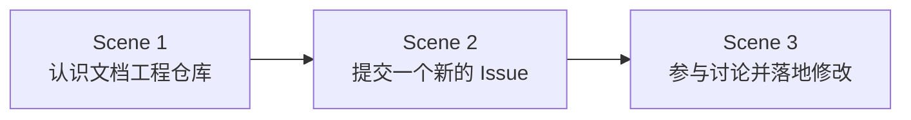

# 氛围编程 — 课时3：提交第一个 GitHub Issue

课时 "氛围编程" 的第三个课时，包含 3 个场景（Scene），顺序推进：

## 场景列表

| 场景 | 标题 | 描述 | 前置依赖 |
|------|------|---------|---------|
| Scene 1 | 认识文档工程仓库 | 浏览 `quanttide/bylaw-of-document-engineering` 仓库，通读章程与文档，用"三问清单"找出可改进点 | 无 |
| Scene 2 | 提交一个新的 Issue | 把发现的改进点整理成结构化建议，在仓库 Issues 中新建一个 Issue | Scene 1 |
| Scene 3 | 参与讨论并落地修改 | 跟进讨论、回复评论，达成共识后通过 PR（或口述代劳）把修改落到仓库 | Scene 2 |

## 场景关系

每个场景录制一段短视频，学员按序观看并操作。本课时为**开放式任务**：不限定具体文档或具体问题，任何"顺手 / 困惑 / 缺失"的反馈都可以成为 Issue，长期有效。
